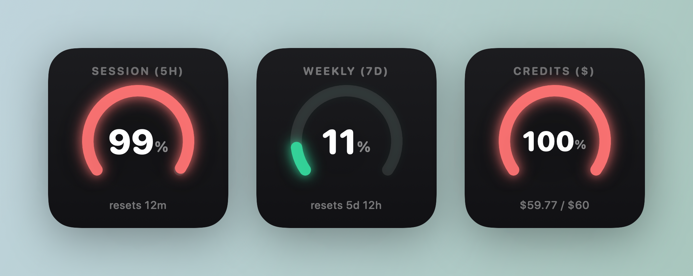

# Claude Usage Gauge

A native macOS **desktop widget** that shows your [Claude](https://claude.ai) usage as a glowing speedometer gauge — right on your desktop or in Notification Center.



Each widget shows one window of your choice:

| Window | What it shows |
|---|---|
| **Session (5h)** | Your rolling 5‑hour session usage |
| **Weekly (7d)** | Your weekly limit across all models |
| **Credits ($)** | Pay‑as‑you‑go "extra usage" spend vs. your monthly cap |

Place several — each set to a different window via **Edit Widget**.

## How it works

Claude Usage Gauge reads usage from the **same endpoint the Claude Code CLI uses** for its `/usage` command — `GET https://api.anthropic.com/api/oauth/usage` — authenticated with the OAuth token Claude Code already stores in your macOS Keychain. It is **read‑only**: it never runs inference, never sends a prompt, and never refreshes or rotates your token.

```
┌──────────────────────────────────────────────────────────┐
│ Menu‑bar host app (non‑sandboxed)                         │
│  • reads the Claude Code OAuth token from the Keychain    │
│  • polls api.anthropic.com/api/oauth/usage (≥3 min)       │
│  • writes the parsed usage into the widget's container    │
└──────────────────────────────────────────────────────────┘
                          │
                          ▼
┌──────────────────────────────────────────────────────────┐
│ WidgetKit extension (sandboxed)                           │
│  • renders the gauge from the cached usage                │
│  • per‑instance picker chooses Session / Weekly / Credits │
└──────────────────────────────────────────────────────────┘
```

The host runs as a background menu‑bar agent and feeds the sandboxed widget; the widget itself never touches the network or the Keychain.

## Requirements

- macOS 14 (Sonoma) or later
- Xcode 15+ (to build from source)
- The [Claude Code CLI](https://claude.com/claude-code) installed and signed in (this is where the usage token comes from)

## Install

This is built from source — no pre‑built binary is distributed.

```sh
git clone https://github.com/angelo-swe/claude-usage-gauge.git
cd claude-usage-gauge
./deploy.sh
```

`deploy.sh` builds the app, installs it to `~/Applications`, registers the widget, and launches the menu‑bar agent. If you have an Apple Development signing identity it's used automatically (so the Keychain grant persists across rebuilds); otherwise it falls back to ad‑hoc signing.

**First launch** shows one macOS Keychain prompt — *"Claude Usage Gauge wants to use … Claude Code‑credentials"* — choose **Always Allow** so the app can read your token.

Then add the widget: right‑click the desktop → **Edit Widgets** → search **"Claude Usage Gauge"** → drag out the small size. Right‑click it → **Edit Widget** to pick the window.

## Updating the User‑Agent

The usage endpoint rate‑limits requests that don't send a `claude-code/<version>` User‑Agent. The version is set in `ClaudeGauge/Services/APIService.swift` (`UsageAPI.userAgent`); bump it if your Claude Code version changes and you start seeing `HTTP 429`.

## A note on terms of service

This tool reuses **your own** Claude Code OAuth token to read **your own** usage, read‑only. That is materially lower‑risk than scraping the claude.ai web session, and it is not the inference‑via‑third‑party‑tools behavior Anthropic actively restricts. However, Anthropic's consumer terms intend that token for use with Claude Code and claude.ai, so this is a gray area — use it at your own discretion. If your token expires (e.g. you haven't run Claude Code in a while), the widget shows "Token expired — run Claude Code to refresh"; it never refreshes the token itself.

## License

[MIT](LICENSE) © 2026 Angelo Trifanoff
